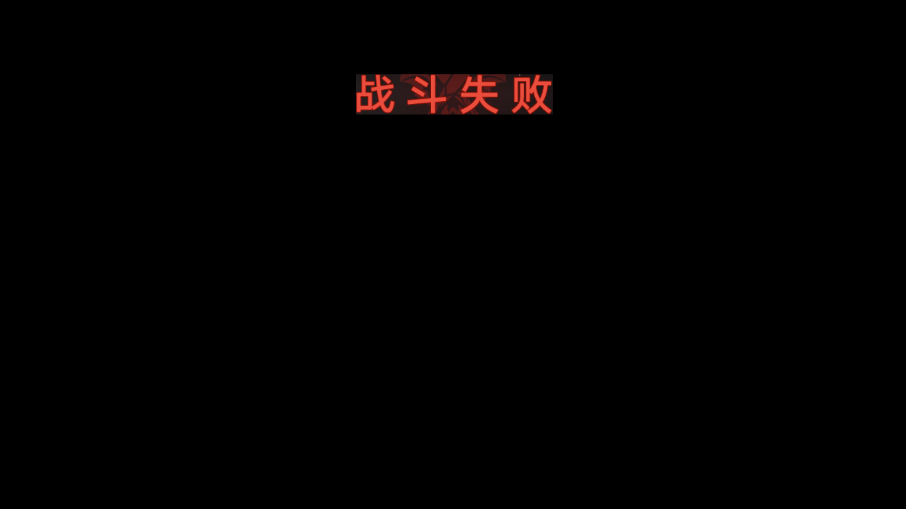
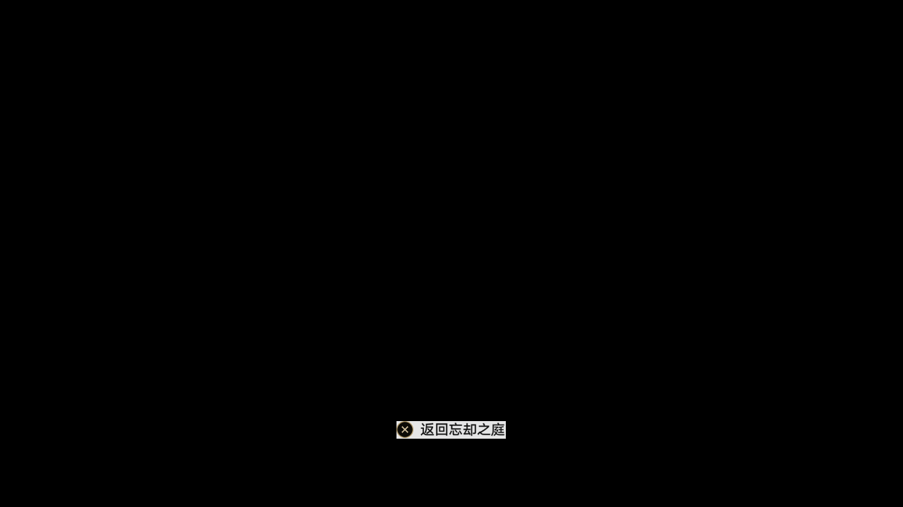
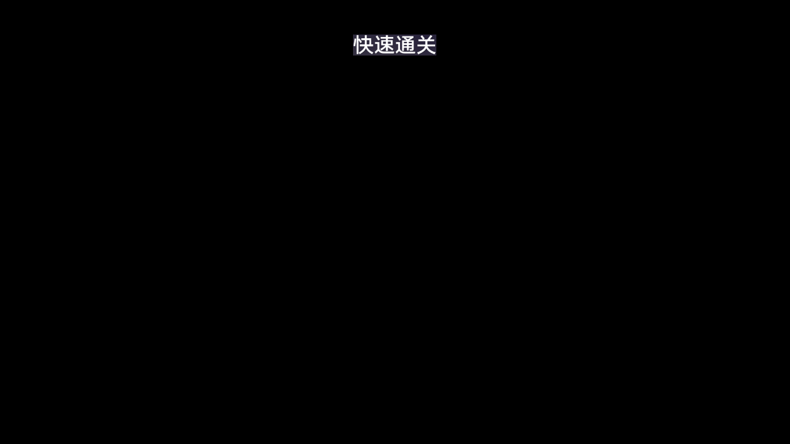

# 深渊挑战流程说明：以忘却之庭 / 混沌回忆为例

本文档按当前代码实现整理 `ForgottenHallChallenge` 的完整执行链路，重点说明每一步识别什么、点击哪里、目的是什么，并展示对应的模板截图文件。

适用入口：

- `src.py -> forgotten_hall_challenge()`
- `tasks/forgotten_hall/challenge.py -> ForgottenHallChallenge.run()`
- 默认配置中的深渊类型为 `Memory_of_Chaos`

说明：

- 坐标基于 `1280x720` 游戏截图。
- 图片均引用仓库内已有 PNG 模板。
- 有些动作是直接坐标点击或摇杆/按键操作，没有独立模板文件，文档中会特别标注。

## 当前代码结构

`ForgottenHallUI` 仍然从 `tasks/forgotten_hall/ui.py` 导出，外部调用路径不变；实际实现已经拆到更小的内部模块中：

```text
tasks/forgotten_hall/ui.py
└── ForgottenHallUI 兼容聚合类

tasks/forgotten_hall/stage_ocr.py
└── ForgottenHallStageOcr / DraggableStageList / STAGE_LIST

tasks/forgotten_hall/ui_parts/
├── pure_fiction.py      # 虚构叙事识别、选关、Buff、专用配队入口
├── stage_selection.py   # 模式入口、页签切换、标准关卡选择、星数扫描
├── preset_team.py       # 预设编队面板、清队、选择上下半预设队
├── battle.py            # 进本、自动寻敌、战斗成功/失败处理、退出副本
└── reward.py            # 深渊奖励红点、领取、返回
```

`tasks/forgotten_hall/challenge.py` 负责调度手动/自动挑战，并复用内部战斗结束判断 helper，避免上下半战斗重复维护。

## 1. 主入口与配置读取

入口方法：

```text
src.py
└── forgotten_hall_challenge()
    └── ForgottenHallChallenge(config=self.config, device=self.device).run()
```

`run()` 首先执行：

1. `ui_goto_main()`：确保游戏回到主界面。
2. 读取深渊挑战配置。
3. 判断是否启用自动选关。
4. 按 `DungeonTypes` 逐个执行目标深渊类型。

关键配置：

| 配置项 | 含义 |
|---|---|
| `ForgottenHallChallenge_DungeonTypes` | 要挑战的深渊类型列表，默认包含 `Memory_of_Chaos` |
| `ForgottenHallChallenge_DungeonType` | 旧版单选深渊类型配置 |
| `ForgottenHallChallenge_Stage` | 手动模式下挑战的关卡号 |
| `ForgottenHallChallenge_Team1Preset` | 上半使用的预设编队编号 |
| `ForgottenHallChallenge_Team2Preset` | 下半使用的预设编队编号 |
| `ForgottenHallChallenge_AutoStageSelection` | 是否自动扫描星数并自动选关 |
| `ForgottenHallChallenge_TargetStars` | 自动模式目标星数 |
| `ForgottenHallChallenge_MinStage` | 自动模式最低挑战关卡 |

## 2. 自动模式总逻辑

自动模式入口：

```text
ForgottenHallChallenge.run()
└── run_auto_selection(dungeon_type="Memory_of_Chaos")
    └── StandardDungeonMode.run_auto_selection(...)
```

逻辑顺序：

1. 导航到混沌回忆关卡选择页。
2. 检查并领取右下角可领奖励。
3. OCR 当前可见关卡，读取每关星数与锁定状态。
4. 找到最高的未达目标星数关卡。
5. 挑战该关卡。
6. 成功后领取奖励，并向更高关卡推进。
7. 失败时：
   - 初始阶段 `EXPLORING_DOWN`：向低一层回退。
   - 爬升阶段 `CLIMBING_UP`：先交换上下半队伍再尝试。
8. 最高关卡达到目标星数后结束。

自动选关状态机：

```text
进入关卡页
  ↓
识别当前可见关卡星数
  ↓
最高未达标关卡
  ↓
挑战
  ├─ 成功：领取奖励 → 下一层
  └─ 失败：
      ├─ 探底阶段：降一层
      └─ 爬升阶段：交换上下半队伍，再失败则停止
```

## 3. 手动模式总逻辑

手动模式入口：

```text
ForgottenHallChallenge.run()
└── _run_manual_single_dungeon(...)
```

逻辑顺序：

1. 校验目标关卡是否在混沌回忆范围 `1-12`。
2. 导航到目标关卡。
3. 配置上半和下半预设编队。
4. 进入副本。
5. 上半战斗，最多重试 3 次。
6. 上半成功后继续下半战斗，最多重试 3 次。
7. 下半成功后返回忘却之庭关卡页。

## 4. 从指南进入忘却之庭

代码路径：

```text
ForgottenHallUI.stage_goto(...)
└── ui_ensure(page_guide)
└── TreasuresLightwardNavigator.goto_forgotten_hall_from_guide(device)
```

导航链路：

| 步骤 | 识别内容 | 点击位置 | 目的 |
|---|---|---|---|
| 1 | `tab/treasures_lightward_click` 或 `tab/treasures_lightward_check` | 逐光捡金 Tab，中心约 `(459, 115)` | 切换到逐光捡金页面 |
| 2 | `nav/forgotten_hall_click` | 忘却之庭 Nav，中心约 `(191, 397)` | 选择忘却之庭入口 |
| 3 | 传送按钮 | 默认坐标 `(1028, 365)` | 进入忘却之庭内部页面 |
| 4 | `FORGOTTEN_HALL_CHECK` | 不点击 | 确认已经进入忘却之庭页面 |

模板截图：

**`tab/treasures_lightward_click`**

用途：点击逐光捡金 Tab。

路径：`tools/forgotten_hall_navigator/assets/tab/treasures_lightward_click.png`


**`tab/treasures_lightward_check`**

用途：确认逐光捡金 Tab 已可见或已选中。

路径：`tools/forgotten_hall_navigator/assets/tab/treasures_lightward_check.png`


**`nav/forgotten_hall_click`**

用途：点击忘却之庭二级导航。

路径：`tools/forgotten_hall_navigator/assets/nav/forgotten_hall_click.png`


**`nav/forgotten_hall_check`**

用途：确认忘却之庭导航内容可见。

路径：`tools/forgotten_hall_navigator/assets/nav/forgotten_hall_check.png`


**`FORGOTTEN_HALL_CHECK`**

用途：确认当前已经进入忘却之庭页面。

路径：`assets/share/base/page/FORGOTTEN_HALL_CHECK.png`


## 5. 选择混沌回忆页签

代码路径：

```text
ForgottenHallUI.stage_choose(KEYWORDS_DUNGEON_LIST.Memory_of_Chaos)
```

逻辑：

1. 识别 `MEMORY_OF_CHAOS_CHECK`。
2. 如果已经选中混沌回忆，则结束。
3. 如果未选中，识别 `MEMORY_OF_CHAOS_CLICK` 并点击。
4. 页面可能出现 `TELEPORT` 或忘却之庭 Buff 弹窗，优先处理后继续。

| 步骤 | 识别内容 | 点击位置 | 目的 |
|---|---|---|---|
| 1 | `MEMORY_OF_CHAOS_CHECK` | 不点击 | 判断当前是否已在混沌回忆 |
| 2 | `MEMORY_OF_CHAOS_CLICK` | 左侧混沌回忆图标，中心约 `(70, 125)` | 切到混沌回忆关卡列表 |
| 3 | `TELEPORT` | 传送按钮区域，中心约 `(1028, 365)` | 若仍停留在外部入口，则补点击进入 |

模板截图：

**`MEMORY_OF_CHAOS_CHECK`**

用途：确认混沌回忆页签已选中。

路径：`assets/share/forgotten_hall/nav/MEMORY_OF_CHAOS_CHECK.png`


**`MEMORY_OF_CHAOS_CHECK.2`**

用途：混沌回忆页签选中状态的备用模板。

路径：`assets/share/forgotten_hall/nav/MEMORY_OF_CHAOS_CHECK.2.png`


**`MEMORY_OF_CHAOS_CLICK`**

用途：点击混沌回忆页签。

路径：`assets/share/forgotten_hall/nav/MEMORY_OF_CHAOS_CLICK.png`


**`MEMORY_OF_CHAOS_CLICK.2`**

用途：混沌回忆页签可点击状态的备用模板。

路径：`assets/share/forgotten_hall/nav/MEMORY_OF_CHAOS_CLICK.2.png`


**`TELEPORT`**

用途：补点击传送按钮进入忘却之庭内部页面。

路径：`assets/share/forgotten_hall/ui/TELEPORT.png`


## 6. 关卡列表识别与选关

代码路径：

```text
STAGE_LIST = DraggableStageList(...)
ForgottenHallStageOcr.matched_ocr(...)
```

关卡识别逻辑：

1. 在 `OCR_STAGE.area = (0, 281, 1280, 581)` 内查找纯白色数字。
2. 通过连通组件识别单个数字字符。
3. 合并相邻字符，支持 `10`、`11`、`12` 这类两位数。
4. OCR 数字并匹配 `Stage_1` 到 `Stage_12`。
5. 检测黄色星星，聚类后匹配到关卡数字，得到 `0-3` 星。
6. 检测数字下方的“未解锁”文字，标记锁定关卡。
7. 过滤孤立误识别，只保留连续关卡序列。

选关逻辑：

| 步骤 | 识别内容 | 点击位置 | 目的 |
|---|---|---|---|
| 1 | `OCR_STAGE` 大区域 | 不点击 | 识别当前可见关卡 |
| 2 | 目标关卡不在当前视野 | 横向拖动关卡列表 | 把目标关卡拖到可点击范围 |
| 3 | 目标 `Stage_N` OCR 结果按钮 | 点击 OCR 结果对应区域 | 选中目标关卡 |
| 4 | `ENTRANCE_CHECKED` | 不点击 | 确认关卡已选中并进入队伍入口状态 |

模板截图：

**`OCR_STAGE`**

用途：关卡数字与星数识别区域。

路径：`assets/share/forgotten_hall/ui/OCR_STAGE.png`


**`OCR_STAGE.BUTTON`**

用途：关卡 OCR 可点击按钮区域的辅助模板。

路径：`assets/share/forgotten_hall/ui/OCR_STAGE.BUTTON.png`


**`ENTRANCE_CHECKED`**

用途：确认关卡已被选中，页面进入队伍入口状态。

路径：`assets/share/forgotten_hall/ui/ENTRANCE_CHECKED.png`


## 7. 配置上半 / 下半预设编队

代码路径：

```text
ForgottenHallUI._click_preset_team(...)
ForgottenHallUI._configure_preset_teams(...)
ForgottenHallUI.select_preset_team(...)
```

配队流程：

| 步骤 | 识别内容 | 点击位置 | 目的 |
|---|---|---|---|
| 1 | `PRESET_TEAM` | 顶部预设编队按钮，区域 `(318, 83, 394, 108)` | 打开预设编队面板 |
| 2 | `PRESET_TEAM_PANEL_OPENED` 或 `PRESET_TEAM_OPENED` | 不点击 | 确认面板已打开 |
| 3 | `CLEAR_TEAM` | 清空按钮，区域 `(1194, 391, 1218, 408)` | 清掉当前已选角色 |
| 4 | 预设队伍滚动条 ROI `(477, 130, 483, 669)` | 拖动滑块 | 定位到目标预设编队编号 |
| 5 | 当前可见预设队伍槽 | 左侧列表中心 x 约 `247` | 选择目标预设队 |
| 6 | `TEAM_SLOT_BATTLE1_EMPTY` 不再匹配 | 不点击 | 验证上半队伍已填入 |
| 7 | `BATTLE_2_SWITCH` | 直接坐标区域 `(895, 525, 925, 595)` | 切换到下半配置 |
| 8 | 重复选择预设队 | 左侧列表槽位 | 选择下半预设队 |
| 9 | `TEAM_SLOT_BATTLE2_EMPTY` 不再匹配 | 不点击 | 验证下半队伍已填入 |

直接坐标：

- `BATTLE_2_SWITCH` 是代码内直接坐标按钮，没有模板图片文件。
- 预设队伍列表槽位也是临时构造点击区域，没有固定模板文件。

模板截图：

**`PRESET_TEAM`**

用途：点击顶部预设编队按钮。

路径：`assets/share/forgotten_hall/ui/PRESET_TEAM.png`


**`PRESET_TEAM_PANEL_OPENED`**

用途：确认新版预设编队面板已经打开。

路径：`tools/forgotten_hall_navigator/assets/PRESET_TEAM_PANEL_OPENED.png`


**`PRESET_TEAM_OPENED`**

用途：确认旧版预设编队面板已经打开。

路径：`tools/forgotten_hall_navigator/assets/PRESET_TEAM_OPENED.png`


**`CLEAR_TEAM`**

用途：清空当前已选队伍。

路径：`assets/share/forgotten_hall/ui/CLEAR_TEAM.png`


**`TEAM_SLOT_BATTLE1_EMPTY`**

用途：验证上半队伍槽位是否为空；选择预设队后应不再匹配。

路径：`tools/forgotten_hall_navigator/assets/TEAM_SLOT_BATTLE1_EMPTY.png`


**`TEAM_SLOT_BATTLE2_EMPTY`**

用途：验证下半队伍槽位是否为空；选择预设队后应不再匹配。

路径：`tools/forgotten_hall_navigator/assets/TEAM_SLOT_BATTLE2_EMPTY.png`


**`SEAT_1`**

用途：检测 1 号角色位是否为空。

路径：`assets/share/forgotten_hall/ui/SEAT_1.png`


**`SEAT_2`**

用途：检测 2 号角色位是否为空。

路径：`assets/share/forgotten_hall/ui/SEAT_2.png`


**`SEAT_3`**

用途：检测 3 号角色位是否为空。

路径：`assets/share/forgotten_hall/ui/SEAT_3.png`


**`SEAT_4`**

用途：检测 4 号角色位是否为空。

路径：`assets/share/forgotten_hall/ui/SEAT_4.png`


## 8. 进入副本

代码路径：

```text
ForgottenHallChallenge._challenge_stage(...)
└── _click_enter_dungeon(...)
```

进入逻辑：

1. 处理“点击空白关闭提示”。
2. 处理忘却之庭 Buff 弹窗。
3. 检查是否已经在地图或战斗中。
4. 判断队伍是否准备好：
   - `team_prepared()` 读取 `ENTER_FORGOTTEN_HALL_DUNGEON.area` 的按钮颜色。
   - 按钮足够亮，说明可以进入。
5. 点击 `ENTER_FORGOTTEN_HALL_DUNGEON`。
6. 等待进入地图或进入战斗。

| 步骤 | 识别内容 | 点击位置 | 目的 |
|---|---|---|---|
| 1 | `ENTER_FORGOTTEN_HALL_DUNGEON` | 区域 `(953, 640, 1225, 676)` | 进入副本 |
| 2 | `DUNGEON_ENTER_CHECKED` 或地图退出状态 | 不点击 | 确认已经进本 |

模板截图：

**`ENTER_FORGOTTEN_HALL_DUNGEON`**

用途：点击进入副本。

路径：`assets/share/forgotten_hall/ui/ENTER_FORGOTTEN_HALL_DUNGEON.png`


**`DUNGEON_ENTER_CHECKED`**

用途：确认已经进入副本地图。

路径：`assets/share/forgotten_hall/ui/DUNGEON_ENTER_CHECKED.png`


## 9. 自动寻敌并开战

代码路径：

```text
ForgottenHallUI.auto_engage_enemy(...)
```

寻敌逻辑：

1. 用摇杆向前移动，默认持续 `8s`。
2. 持续调用 `handle_map_run_2x()` 尝试开启 2 倍跑。
3. 每 `0.3s` 调用 `aim.predict(image, enemy=True)` 检测敌人。
4. 如果检测到敌人，点击地图攻击键 `A_BUTTON`。
5. 如果移动阶段没有进战斗，停止移动继续原地找敌。
6. 如果仍失败，执行 `combat_poor_try()` 兜底，连续尝试攻击。

这一段主要使用地图控制、敌人检测和攻击键，不是忘却之庭专属模板，所以没有单独列入本文件的模板表。

## 10. 上半 / 下半战斗执行

代码路径：

```text
ForgottenHallChallenge._challenge_stage(...)
└── combat_execute(expected_end=is_battle_end)
```

混沌回忆有两场战斗：

1. `Battle 1: Upper Half`
2. `Battle 2: Lower Half`

每场战斗的结束条件：

| 识别内容 | 含义 | 后续动作 |
|---|---|---|
| `BATTLE_FAILED` | 战斗失败 | 点击返回忘却之庭，回到关卡页重试或停止 |
| `RETURN_TO_FORGOTTEN_HALL` | 成功或失败结算页出现返回按钮 | 点击返回忘却之庭 |
| `COMBAT_AGAIN` | 通用战斗结束/再来一次按钮 | 点击处理结算 |
| `FORGOTTEN_HALL_CHECK` | 已回到忘却之庭页 | 结束战斗处理 |

下半成功后会执行 `handle_battle_success()`，处理快速通关弹窗、奖励弹窗、返回按钮，最终回到关卡选择页。

模板截图：

**`BATTLE_FAILED`**

用途：识别战斗失败结算页。

路径：`tools/forgotten_hall_navigator/assets/battle/BATTLE_FAILED.png`



**`RETURN_TO_FORGOTTEN_HALL_SUCCESS`**

用途：成功结算页的返回忘却之庭按钮。

路径：`tools/forgotten_hall_navigator/assets/battle/RETURN_TO_FORGOTTEN_HALL_SUCCESS.png`



**`RETURN_TO_FORGOTTEN_HALL`**

用途：失败结算页的返回忘却之庭按钮。

路径：`tools/forgotten_hall_navigator/assets/battle/RETURN_TO_FORGOTTEN_HALL.png`


**`QUICK_COMPLETE_TITLE`**

用途：识别快速通关弹窗标题。

路径：`assets/share/forgotten_hall/ui/QUICK_COMPLETE_TITLE.png`



**`QUICK_COMPLETE_CONFIRM`**

用途：点击快速通关弹窗确认按钮。

路径：`assets/share/forgotten_hall/ui/QUICK_COMPLETE_CONFIRM.png`


## 11. 失败处理与重试

失败处理代码：

```text
ForgottenHallUI.handle_battle_failure(...)
```

逻辑：

1. 在失败页识别 `RETURN_TO_FORGOTTEN_HALL`。
2. 点击返回忘却之庭。
3. 等待 `FORGOTTEN_HALL_CHECK` 或关卡选择页特征出现。
4. 回到关卡选择页后重新加载关卡 OCR。
5. 手动模式中每半最多重试 `3` 次。
6. 自动模式中失败后按状态机决定降层或交换队伍。

## 12. 成功处理与奖励领取

成功处理代码：

```text
ForgottenHallUI.handle_battle_success(...)
ForgottenHallUI.check_and_claim_rewards(...)
```

成功结算逻辑：

1. 如果出现快速通关弹窗，点击 `QUICK_COMPLETE_CONFIRM`。
2. 如果出现 `COMBAT_AGAIN`，点击处理结算。
3. 如果出现奖励弹窗，调用通用 `handle_reward()`。
4. 如果回到 `FORGOTTEN_HALL_CHECK`，认为结算处理完成。

奖励领取逻辑：

1. 在关卡选择页检查 `REWARD_INDICATOR`。
2. 点击右下角奖励提示。
3. 在奖励界面识别 `REWARD_CLAIM_BUTTON` 并点击领取。
4. 处理奖励弹窗。
5. 点击 `REWARD_EXIT` 回到关卡选择页。

模板截图：

**`REWARD_INDICATOR`**

用途：识别关卡选择页右下角可领取奖励提示。

路径：`assets/share/forgotten_hall/ui/REWARD_INDICATOR.png`


**`REWARD_CLAIM_BUTTON`**

用途：点击奖励界面的领取按钮。

路径：`assets/share/forgotten_hall/ui/REWARD_CLAIM_BUTTON.png`


**`REWARD_EXIT`**

用途：点击奖励界面右上角退出按钮。

路径：`assets/share/forgotten_hall/ui/REWARD_EXIT.png`


## 13. 完整顺序清单

以自动挑战混沌回忆为例，实际顺序可以压缩成下面这条链：

```text
回主界面
  ↓
打开星际和平指南
  ↓
点击逐光捡金 Tab
  ↓
点击忘却之庭 Nav
  ↓
点击传送进入
  ↓
确认 FORGOTTEN_HALL_CHECK
  ↓
选择混沌回忆 MEMORY_OF_CHAOS
  ↓
领取可领奖励
  ↓
OCR 关卡与星数
  ↓
选择最高未达标关卡
  ↓
打开预设编队
  ↓
清空队伍
  ↓
选择上半预设队
  ↓
切换下半
  ↓
选择下半预设队
  ↓
点击进入副本
  ↓
自动前进寻敌
  ↓
上半战斗
  ↓
自动寻敌
  ↓
下半战斗
  ↓
处理成功/失败/奖励
  ↓
回到关卡页
  ↓
自动模式继续判断下一层或结束
```

## 14. 模板文件索引

外部导航：

- `tools/forgotten_hall_navigator/assets/tab/treasures_lightward_click.png`
- `tools/forgotten_hall_navigator/assets/tab/treasures_lightward_check.png`
- `tools/forgotten_hall_navigator/assets/nav/forgotten_hall_click.png`
- `tools/forgotten_hall_navigator/assets/nav/forgotten_hall_check.png`

忘却之庭 / 混沌回忆：

- `assets/share/base/page/FORGOTTEN_HALL_CHECK.png`
- `assets/share/forgotten_hall/nav/MEMORY_OF_CHAOS_CHECK.png`
- `assets/share/forgotten_hall/nav/MEMORY_OF_CHAOS_CHECK.2.png`
- `assets/share/forgotten_hall/nav/MEMORY_OF_CHAOS_CLICK.png`
- `assets/share/forgotten_hall/nav/MEMORY_OF_CHAOS_CLICK.2.png`
- `assets/share/forgotten_hall/ui/TELEPORT.png`

关卡与入口：

- `assets/share/forgotten_hall/ui/OCR_STAGE.png`
- `assets/share/forgotten_hall/ui/OCR_STAGE.BUTTON.png`
- `assets/share/forgotten_hall/ui/ENTRANCE_CHECKED.png`
- `assets/share/forgotten_hall/ui/ENTER_FORGOTTEN_HALL_DUNGEON.png`
- `assets/share/forgotten_hall/ui/DUNGEON_ENTER_CHECKED.png`

配队：

- `assets/share/forgotten_hall/ui/PRESET_TEAM.png`
- `tools/forgotten_hall_navigator/assets/PRESET_TEAM_PANEL_OPENED.png`
- `tools/forgotten_hall_navigator/assets/PRESET_TEAM_OPENED.png`
- `assets/share/forgotten_hall/ui/CLEAR_TEAM.png`
- `tools/forgotten_hall_navigator/assets/TEAM_SLOT_BATTLE1_EMPTY.png`
- `tools/forgotten_hall_navigator/assets/TEAM_SLOT_BATTLE2_EMPTY.png`
- `assets/share/forgotten_hall/ui/SEAT_1.png`
- `assets/share/forgotten_hall/ui/SEAT_2.png`
- `assets/share/forgotten_hall/ui/SEAT_3.png`
- `assets/share/forgotten_hall/ui/SEAT_4.png`

战斗与结算：

- `tools/forgotten_hall_navigator/assets/battle/BATTLE_FAILED.png`
- `tools/forgotten_hall_navigator/assets/battle/RETURN_TO_FORGOTTEN_HALL_SUCCESS.png`
- `tools/forgotten_hall_navigator/assets/battle/RETURN_TO_FORGOTTEN_HALL.png`
- `assets/share/forgotten_hall/ui/QUICK_COMPLETE_TITLE.png`
- `assets/share/forgotten_hall/ui/QUICK_COMPLETE_CONFIRM.png`

奖励：

- `assets/share/forgotten_hall/ui/REWARD_INDICATOR.png`
- `assets/share/forgotten_hall/ui/REWARD_CLAIM_BUTTON.png`
- `assets/share/forgotten_hall/ui/REWARD_EXIT.png`
